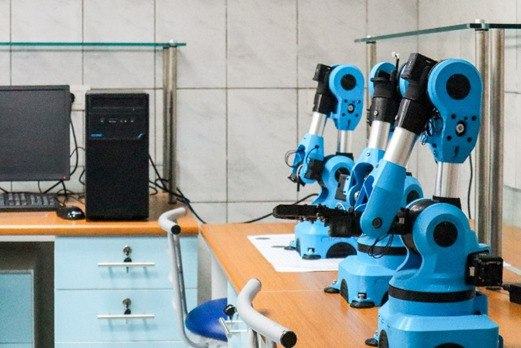

# Serial Robots Class - Kinematics and Niryo Arm Control

This repository contains MATLAB code from my Serial Robots class. It includes implementations for Direct Kinematic Modeling (DKM) and Inverse Kinematic Modeling (IKM) for general serial robots and the Niryo One robotic arm. It also covers transformation matrices, rotation matrices, Jacobians, and velocity kinematics.
<div align="center">
  
  <p style="font-style: italic;">Robotics Lab</p>
</div>


## Repository Structure

```
📂 general
├── dhMatrix.m                 % DH parameter matrix for general robots
├── dkm.m                      % Direct Kinematic Modeling for general robots
├── ikm.m                      % Inverse Kinematic Modeling for general robots
├── 📂 helper
│   └── make_readable_transform.m % Helper function for readable transformations
├── 📂 rotationMatrices
│   ├── eulerAngles.m          % Compute Euler angles
│   ├── eulerMatrix.m          % Compute Euler transformation matrix
│   ├── rollPitchYaw.m         % Compute Roll-Pitch-Yaw matrix
│   └── rollPitchYawAngles.m   % Compute Roll-Pitch-Yaw angles
└── 📂 velocity
    └── JacobianV.m            % Jacobian matrix for velocity kinematics

📂 niryo
├── dhTable_with_Variables.m   % Variable-based DH parameter table for Niryo
├── dhTableNiryo.m             % Standard DH table for Niryo
├── dkmNiryo.m                 % Direct Kinematic Modeling for Niryo
├── dvmNiryo.m                 % Direct Velocity Modeling for Niryo
├── getDHTable.m               % Function to retrieve Niryo DH table
├── ikmNiryo.m                 % Inverse Kinematic Modeling for Niryo
└── ivmNiryo.m                 % Inverse Velocity Modeling for Niryo
```

## Features

### 1. General Serial Robots
- **DKM:** Computes end-effector position and orientation for given joint angles.
- **IKM:** Solves for joint angles to reach desired positions.
- **Rotation Matrices:** Functions to compute transformation matrices and extract angles.
- **Velocity Kinematics:** Jacobian matrix for velocity modeling.

### 2. Niryo Robot Arm
- **DKM and IKM:** Customized implementations for the Niryo One robotic arm.
- **Velocity Kinematics:** Direct and inverse velocity models specific to Niryo.

## Requirements
- MATLAB R2022b (or a compatible version)

## Usage

### General Serial Robot Example
```matlab
% Example joint angles
joint_angles = [0.5; 0.3; -0.2; 0.1];
position = dkm(joint_angles);
disp('End-effector position:');
disp(position);
```

### Niryo Robot Example
```matlab
% Example joint angles for Niryo
joint_angles = [0.5; 0.3; -0.2; 0.1; 0.6; -0.4];
position = dkmNiryo(joint_angles);
disp('Niryo End-effector position:');
disp(position);
```

## License
This project is licensed under the MIT License. See the `LICENSE` file for details.

## Contributing
Contributions are welcome!.

## Acknowledgments
Gratitude to the Serial Robots class.
